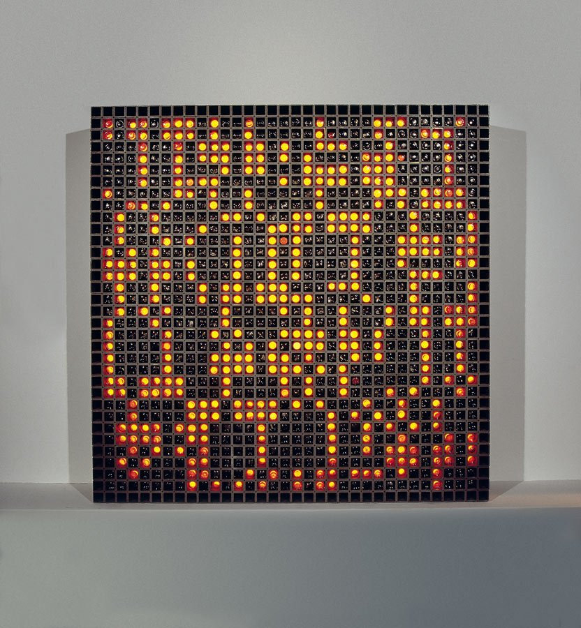

# Bonačić Matrix

This project is an homage to the works of the Croation artist Vladimir Bonačić. Specifically, my goal was to recreate the electronic object piece titled <i>GF 16 NS</i> (pictured below).

When I saw this piece at the Walker Art Center in Minneapolis, I was instantly enamored. I felt myself slipping into a trance-like state as I stared at the matrix. My brain was full of static as I tried to find patterns. As soon as I felt that a pattern emerged, the matrix took on a different form. I may have stood in the corner gazing upon this magnificent work for 5 minutes or an hour. I had no concept of time. When I finally looked away, I felt as though I had emerged from a cold lake; I felt refreshed, calm, reset. On top of it all, I felt inspired.

That inspiration brought me here. I want others to be able to experience what I experienced, and I selfishly want to be able to experience it at the push of a button, for as long as I like.

<figure align="center">
	
  <figcaption><i>GF NS 16</i> by Vladimir Bonačić</figcaption>
  <figcaption><a href=https://digitalna-umjetnost-u-hrvatskoj.eu/en/autori/vladimir-bonacic>Learn more</a><figcaption>
</figure>
